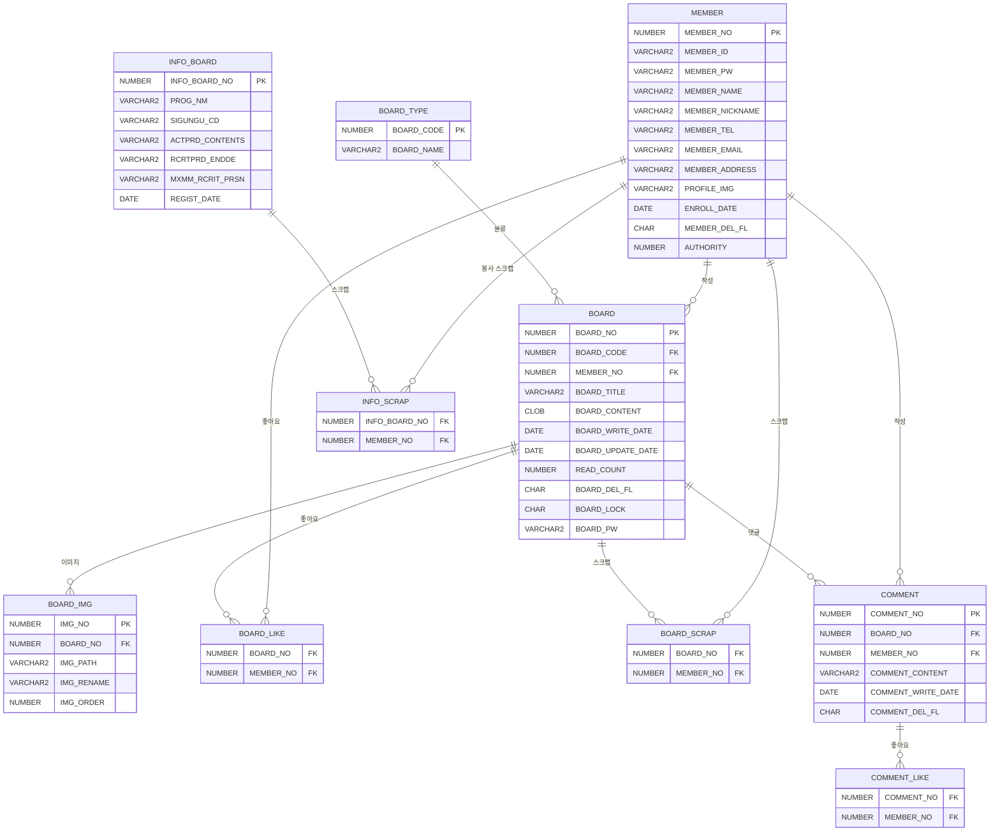

# 🌱 온기로 — 봉사 커뮤니티 플랫폼

> **"온기를 나누는 곳, 봉사로 이어지는 사람들"**

---

## 🌿 프로젝트 개요

### 1. 기획의도

- 봉사활동에 관심 있는 사람들이 정보를 쉽게 찾고 소통할 수 있는 플랫폼 부재
- 1365 자원봉사 포털 API를 연동하여 실시간 봉사 공고 정보를 제공
- 게시판, 후기 공유, 커뮤니티 기능을 통해 봉사 문화 활성화 기여
- 관리자 시스템으로 건전한 커뮤니티 운영 지원

---

## 💡 프로젝트 목적

> "봉사 정보 조회부터 커뮤니티 소통까지, 봉사자들이 한곳에서 모든 것을 해결할 수 있는 종합 봉사 커뮤니티 플랫폼 구축"

### ⚙️ 제공하는 기능

- **봉사 정보 게시판** : 1365 자원봉사 포털 API 연동, 지역·분야별 필터링 및 스크랩
- **자유게시판** : 자유로운 글 작성, 좋아요·댓글·스크랩, 이미지 업로드, 썸네일
- **봉사후기 게시판** : 봉사 활동 경험 공유, 이미지 첨부 지원
- **공지사항** : 운영 공지 게시 (댓글 비활성화)
- **고객지원** : 비밀글 기능 지원, 1:1 문의
- **회원 시스템** : 회원가입·로그인·로그아웃, 아이디·비밀번호 찾기 (이메일 인증)
- **마이페이지** : 프로필·사진 수정, 내 작성글·댓글·스크랩 조회, 비밀번호 변경, 회원 탈퇴
- **관리자 페이지** : 회원 관리, 공지사항 관리, 고객지원 관리, 신고 처리

---

## 😎 프로젝트 소개

### 1. 개발자 소개

| 이름 | 브랜치 | 핵심 담당 |
|------|--------|-----------|
| 안재훈 | `developer_AJH` | 게시판 전체 · 메인 페이지 · 프로젝트 초기 세팅 |
| 전재민 | `dev_JJM` | 회원가입 · 로그인 · 마이페이지 |
| 현동근 | `dev_HDK` | 관리자 페이지 전체 |
| 홍윤기 | `dev_HYG` | 봉사 정보 게시판 (1365 API) |
| 조창래 | `dev_CCL` | 댓글 시스템 · 아이디/비밀번호 찾기 · 회원 탈퇴 |

### 2. 상세 역할

**안재훈** (`developer_AJH`)
- 프로젝트 초기 세팅 (config, mapper, 헤더 인터셉터, CSS 폴더 구조)
- 게시판 통합 개발 — 자유게시판 · 봉사후기 · 공지사항 · 고객지원 (목록 · 상세 · 작성 · 수정 · 삭제)
- 비밀글 기능, 조회수 (쿠키 기반 중복 방지), 좋아요 · 스크랩 · 신고
- 이미지 업로드 (Summernote), 썸네일 자동 지정, 이미지 삭제 스케줄러
- 메인 페이지, 404/500 에러 페이지, 관리자 게시글 삭제 기능

**전재민** (`dev_JJM`)
- 회원가입 (HTML/CSS/기능 · 이메일 인증 · 카카오 주소 · 유효성 검사)
- 로그인 · 로그아웃
- 마이페이지 — 내 작성글 · 댓글 단 글 · 스크랩 목록 (검색 · 페이지네이션)
- 마이페이지 — 개인정보 수정 · 비밀번호 변경
- 봉사 정보 게시판 스크랩 기능

**현동근** (`dev_HDK`)
- 관리자 페이지 HTML 전체 퍼블리싱
- 회원 관리 (조회 · 검색 · 강제 탈퇴 · 복구)
- 공지사항 관리 (글 작성 · 삭제 · 복구)
- 고객지원 관리 (상세 조회 · 검색)
- 신고글 목록 · 상세 페이지 (기각 · 삭제 · 이전/다음글), 관리자 접근 제어

**홍윤기** (`dev_HYG`)
- 봉사 정보 게시판 설계 및 전체 구현
- 1365 Open API 연동 · DB 동기화
- 시도 · 시군구 기반 지역 필터, CSS

**조창래** (`dev_CCL`)
- 댓글 시스템 — 작성 · 수정 · 삭제 · 좋아요 · 신고 · 대댓글 · 권한 관리 (고객지원 작성자/관리자)
- 아이디 찾기 — HTML/CSS/JS 퍼블리싱 · 이메일 인증 (인증번호 발송)
- 비밀번호 찾기 · 재설정 — 프론트엔드 · 백엔드 구현
- 마이페이지 — 회원 탈퇴

### 3. 개발 기간

- 2025.12 ~ 2026.01 (팀 프로젝트)
- GitHub Organization: [Trouble-Developer](https://github.com/Trouble-Developer/semi_project)

---

## 🛠 기술 스택

### Backend

| 분류 | 기술 |
|------|------|
| 프레임워크 | Spring Boot 3.5.8 |
| 언어 | Java 21 |
| ORM | MyBatis 3.0.5 |
| 데이터베이스 | Oracle DB (ojdbc11) |
| 보안 | Spring Security (BCryptPasswordEncoder) |
| 메일 | Spring Mail |
| 실시간 통신 | Spring WebSocket |
| 빌드 | Gradle |

### Frontend

| 분류 | 기술 |
|------|------|
| 템플릿 엔진 | Thymeleaf + Thymeleaf Security |
| 스타일 | CSS (모듈별 분리) |
| 스크립트 | Vanilla JavaScript |
| 에디터 | Summernote (이미지 포함 리치 텍스트) |
| 슬라이더 | Swiper.js |
| 외부 API | 1365 자원봉사 포털 Open API, 카카오 주소 API |

---

## 🗂 ERD



---

## 📁 프로젝트 구조

```
semiProject/
├── build.gradle
└── src/
    ├── main/
    │   ├── java/edu/kh/project/
    │   │   ├── SemiProjectApplication.java      # 메인 클래스
    │   │   ├── admin/                           # 관리자
    │   │   │   ├── controller/AdminController.java
    │   │   │   ├── dto/                         # AdminMember, AdminNotice, Report 등
    │   │   │   └── model/                       # mapper / service
    │   │   ├── board/                           # 게시판
    │   │   │   ├── controller/
    │   │   │   │   ├── BoardController.java     # 목록·상세·좋아요·스크랩·신고
    │   │   │   │   ├── CommentController.java   # 댓글 CRUD
    │   │   │   │   └── EditBoardController.java # 글 작성·수정·삭제
    │   │   │   └── model/                       # dto / mapper / service
    │   │   ├── common/                          # 공통
    │   │   │   ├── config/                      # DB, File, Security, Interceptor
    │   │   │   ├── exception/ExceptionController.java
    │   │   │   ├── interceptor/BoardTypeInterceptor.java
    │   │   │   ├── scheduling/ImageDeleteScheduling.java
    │   │   │   └── util/Utility.java
    │   │   ├── email/                           # 이메일 인증
    │   │   ├── info/                            # 봉사 정보 게시판 (1365 API)
    │   │   │   ├── controller/InfoBoardController.java
    │   │   │   └── model/                       # dto / mapper / service
    │   │   ├── main/                            # 메인 페이지
    │   │   └── member/                          # 회원
    │   │       ├── controller/MemberController.java
    │   │       └── model/                       # dto(Member) / mapper / service
    │   │   └── mypage/                          # 마이페이지
    │   │       └── controller/MyPageController.java
    │   └── resources/
    │       ├── mappers/                         # MyBatis mapper XML
    │       │   ├── Admin-mapper.xml
    │       │   ├── board-mapper.xml
    │       │   ├── comment-mapper.xml
    │       │   ├── edit-board.xml
    │       │   ├── email-mapper.xml
    │       │   ├── info-board-mapper.xml
    │       │   ├── main-mapper.xml
    │       │   ├── member-mapper.xml
    │       │   └── mypage-mapper.xml
    │       ├── static/
    │       │   ├── css/                         # 기능별 CSS
    │       │   │   ├── admin/
    │       │   │   ├── board/
    │       │   │   ├── common/
    │       │   │   ├── error/
    │       │   │   ├── info/
    │       │   │   ├── member/
    │       │   │   └── mypage/
    │       │   ├── js/                          # 기능별 JavaScript
    │       │   └── images/
    │       ├── templates/                       # Thymeleaf HTML
    │       │   ├── admin/
    │       │   ├── board/
    │       │   ├── common/
    │       │   ├── email/
    │       │   ├── error/
    │       │   ├── info/
    │       │   ├── member/
    │       │   └── mypage/
    │       ├── application.properties
    │       ├── config.properties
    │       └── mybatis-config.xml
    └── test/
```

---

## 🚀 로컬 실행 방법

```bash
# 프로젝트 루트에서 실행
./gradlew bootRun
# 또는
./gradlew build && java -jar build/libs/semiProject-0.0.1-SNAPSHOT.jar
```

> ⚠️ `src/main/resources/config.properties`에 아래 환경 변수 설정 필요

```properties
# Oracle DB
spring.datasource.url=jdbc:oracle:thin:@localhost:1521:xe
spring.datasource.username=YOUR_USERNAME
spring.datasource.password=YOUR_PASSWORD

# 이메일 (Spring Mail)
spring.mail.username=YOUR_EMAIL
spring.mail.password=YOUR_APP_PASSWORD

# 파일 업로드 경로
profile.image.web-path=/images/member/
profile.image.folder-path=C:/upload/profile/

# 1365 Open API Key
api.key=YOUR_1365_API_KEY
```

> ⚠️ 서버 포트는 `80` (HTTP 기본 포트), 브라우저에서 포트 번호 없이 `http://localhost`로 접속

---

## 📌 주요 구현 포인트

- **1365 Open API 연동** : 자원봉사 포털 API를 호출하여 DB에 동기화, 지역(시도·시군구) 코드 기반 필터링 지원
- **게시판 타입 인터셉터** : `BoardTypeInterceptor`로 모든 요청마다 게시판 분류 목록을 Application Scope에 자동 주입
- **조회수 중복 방지** : 쿠키(`readBoardNo`)로 당일 읽은 게시글 추적, 자정에 만료되도록 MaxAge 동적 계산
- **비밀글 기능** : `BOARD_LOCK` 컬럼과 별도 비밀번호(`BOARD_PW`) 검증, 작성자/관리자만 열람 가능
- **썸네일 자동 지정** : 게시글 대표 이미지를 `IMG_ORDER = 0`으로 관리, Summernote 에디터 내 이미지 비동기 업로드
- **이미지 스케줄 삭제** : `ImageDeleteScheduling`으로 DB에서 삭제된 이미지 파일을 주기적으로 서버에서 제거
- **BCrypt 암호화** : Spring Security `BCryptPasswordEncoder`로 비밀번호 단방향 암호화 저장
- **이메일 인증** : Spring Mail 기반 회원가입 이메일 인증, 아이디 찾기 결과 메일 발송
- **카카오 주소 API** : 회원 가입·프로필 수정 시 우편번호·도로명·상세주소 3단계 분리 저장 (`,,` 구분자)
- **아이디 저장 쿠키** : 로그인 시 체크박스 선택 시 7일간 아이디 쿠키 유지
- **관리자 신고 처리** : 게시글(BOARD)·댓글(COMMENT) 신고 유형별 완전 분리, 신고 기각·삭제 처리
- **페이지네이션 공통화** : `Pagination` 객체로 전체 게시판·관리자 페이지 일관된 페이징 처리

---

## 📊 구현 현황

### ✅ 완료

| # | 기능 |
|---|------|
| 1 | 메인 페이지 (게시판 미리보기, 이달의 봉사왕, Swiper 배너) |
| 2 | 회원가입 (아이디·닉네임·이메일·전화번호 중복 검사, 카카오 주소) |
| 3 | 로그인 / 로그아웃 (세션 관리, 아이디 저장 쿠키) |
| 4 | 아이디 찾기 (이름 + 이메일 확인) |
| 5 | 비밀번호 찾기 / 재설정 (아이디 + 이름 + 이메일 인증) |
| 6 | 자유게시판 (목록·검색·상세·작성·수정·삭제) |
| 7 | 봉사후기 게시판 |
| 8 | 공지사항 게시판 (댓글 비활성화) |
| 9 | 고객지원 게시판 (비밀글 기능) |
| 10 | 게시글 이미지 업로드 (Summernote, 썸네일 자동 지정) |
| 11 | 좋아요 / 스크랩 (비동기 토글) |
| 12 | 조회수 (쿠키 기반 중복 방지, 자정 만료) |
| 13 | 이전글 / 다음글 이동 |
| 14 | 댓글 (작성·수정·삭제, 좋아요) |
| 15 | 게시글 신고 / 댓글 신고 |
| 16 | 봉사 정보 게시판 (1365 API 연동, 지역·분야 필터, 페이지네이션) |
| 17 | 봉사 정보 스크랩 |
| 18 | 마이페이지 - 프로필 수정 (사진, 닉네임, 전화번호, 주소) |
| 19 | 마이페이지 - 내 작성글 / 댓글 단 글 / 스크랩 조회 (검색·페이지네이션) |
| 20 | 마이페이지 - 비밀번호 변경 |
| 21 | 마이페이지 - 회원 탈퇴 |
| 22 | 관리자 - 회원 관리 (조회·검색·강제탈퇴·복구) |
| 23 | 관리자 - 공지사항 관리 (조회·검색·삭제·복구) |
| 24 | 관리자 - 고객지원 관리 (조회·검색·삭제·복구) |
| 25 | 관리자 - 신고 관리 (게시글·댓글 신고 목록, 상세 조회, 기각·삭제) |
| 26 | 이미지 스케줄 삭제 |
| 27 | 404 / 500 에러 페이지 |
| 28 | 이용약관 / 개인정보처리방침 페이지 |

---

## 🗺 라우트 맵

| 경로 | 설명 |
|------|------|
| `/` | 메인 페이지 |
| `/member/login` | 로그인 |
| `/member/signup` | 회원가입 |
| `/member/findId` | 아이디 찾기 |
| `/member/findPw` | 비밀번호 찾기 |
| `/board/{boardCode}` | 게시판 목록 (1:자유, 3:봉사후기, 4:공지, 5:고객지원) |
| `/board/{boardCode}/{boardNo}` | 게시글 상세 |
| `/editBoard/write` | 게시글 작성 |
| `/info/listPage` | 봉사 정보 목록 (1365 API) |
| `/info/detail/{infoBoardNo}` | 봉사 정보 상세 |
| `/mypage/profile` | 프로필 관리 |
| `/mypage/posts` | 내 작성글 |
| `/mypage/comments` | 내가 댓글 단 글 |
| `/mypage/scraps` | 내 스크랩 |
| `/mypage/changePw` | 비밀번호 변경 |
| `/mypage/withdraw` | 회원 탈퇴 |
| `/admin/member` | 관리자 - 회원 관리 |
| `/admin/notice` | 관리자 - 공지사항 관리 |
| `/admin/support` | 관리자 - 고객지원 관리 |
| `/admin/report` | 관리자 - 신고 관리 |
| `/admin/report/{type}/{no}` | 관리자 - 신고 상세 |
